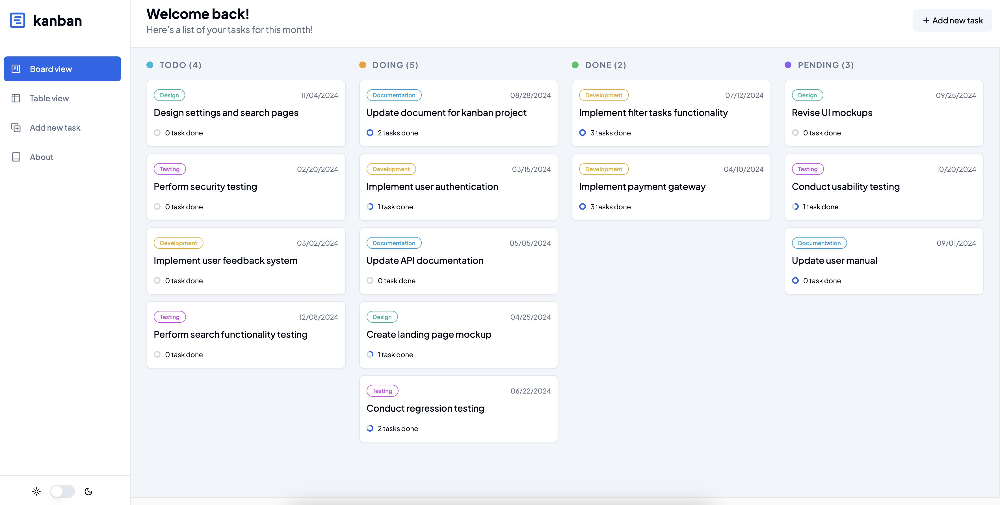

# Kanban Task Management App

Kanban is a robust todo management web application designed to streamline your task organization and productivity.

Try [Kanban production version](https://react-kanban-webapp.netlify.app) for free!



## Key Features

- **Tasks Management**: Create, view, update, and delete tasks effortlessly, ensuring your to-do list is always up-to-date.
- **Board View**: Tasks can be dragged and dropped across four columns - TODO, DOING, DONE, and PENDING, providing a clear visualization of task progress.
- **Table View**: Access a comprehensive list of all tasks in a structured table format for quick reference and overview.
  - **Search Functionality**: Easily search for specific tasks by their title.
  - **Filtering Options**: Filter tasks based on status, priority, and deadline, enabling focused task management.
  - **Sorting Capabilities**: Sort tasks by various criteria for improved organization.
  - **View Columns**: Customize your viewing experience by toggling visibility of columns.
- **Dark/Light Mode**: Switch between dark and light themes to suit your visual preferences.

## Tech Stack

- React
- Redux Toolkit
- Typescript
- TailwindCSS
- ShadcnUI
- TanStack Table

## Getting Started

1. Clone the repository:

```
git clone https://github.com/kimhuy011199/react-kanban
```

2. Install dependencies:

```
npm install
```

3. Start the development server:

```
npm run dev
```

4. Access the application: Visit http://localhost:5173 in your web browser to start managing your tasks with Kanban.
